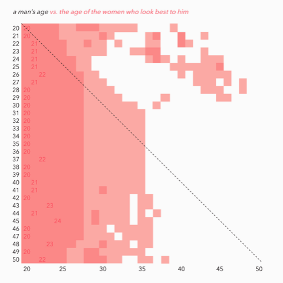
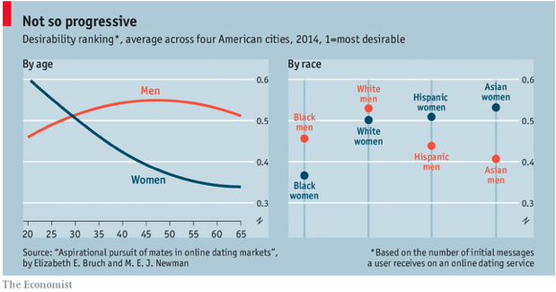

```{r setup, include=FALSE}
setwd("~/Dropbox/Applications/Job Applications/skills_test/Tinder/")
knitr::opts_chunk$set(echo = F, warning = F, message = F)

library(tidyverse)
library(lubridate)
library(magrittr)
library(stargazer)
```
# Initial Dataset Check
```{r load_data}

data = read_csv("take_home_data.csv") %>%
  mutate(day = ymd(day))

glimpse(data)

summary(data)

distinct_values = list()
non_numerics = c("country","device_type","gender")
for (col in non_numerics) {
  distinct_values[col] = data %>%
    distinct(!!as.name(col))
}
distinct_values

num_unique_users = length(unique(data$user_id))
```

# Problem Definition 1

The dataset includes activity for a variety of users (```r num_unique_users```) distributed across 5 countries (```r  distinct_values$country```) during a 1 month period namely ```r min(data$day)```
through ```r max(data$day)```. The dataset records activity focused on user likes sent and received, matches, and then messages sent and received. My primary interest in the data for this exercise, and a big part of my interest more generally, is in the matching aspect of the data.  

Specifically, I am interested in the user experience of users on the app in terms of how happy they might be with their results. My hypothesis is that users who are satisfied with the app will be much less likely to pay for premium features than users who are less satisfied with the app. The assumption is that these premium features will be designed to help dissatisified users get more satisfying results. For the purpose of this exercise, I will define results in the context of matches where "satisfying results" are more matches and "dissatisfying results" are a dearth of matches. Identifying these users is important to Tinder's profitability as we obtain information that will allow us to do two things: (1) Identify the groups of users who are most likely to desire premium features, i.e. have willingness to pay (2) Direct our product teams to design features marketable to these user bases. 

For this exercise I will focus on characteristics which might be considered "vertically differentiated". I discuss horizontal and vertical differentiation within dating markets on my blog^[https://medium.com/the-renaissance-economist/how-an-economist-sees-the-dating-market-eb3afe0c9e35] and encourage the reviewer to read the article for more context but I reproduce the definitions here: 

>"Consider evaluating a car for purchase. There are many different features associated with a car such as, speed, acceleration, horsepower, environmental impact, reliability, car style, car color, etc. In general, almost everyone will agree that higher ratings of speed, acceleration, and reliability will be better than lower ratings of speed, acceleration, and reliability. Similarly, everyone will generally agree that a low environmental impact is better than a high environmental impact. However, not everyone will agree that a certain car color is better than another car color (is black obviously better than blue?), or that a certain car style is inherently better than another (is a Toyota Corolla’s design inherently better than a Honda Civic’s design?). The qualities that everyone can agree on — speed, acceleration, reliability, environmental impact — are classified as being vertically differentiated, i.e. everyone at a market level can agree these are desirable qualities and on their appropriate directions (lower or higher), whereas the qualities that people can’t find consensus on — color, car design — are described as horizontally differentiated. These two terms describe behavior at the market level but do not describe the magnitude of individual preferences for these attributes. For instance, someone might be willing to trade off a certain amount of horsepower for a specified lower environmental impact, but everyone would agree these are both desirable things."

There are a number of vertically differentiated factors, and they are unique to the male and female sides of the dating market (assuming heterosexual dating). Qualities valuable to men who are searching for a female dating partner and qualities valuable to women who are searching for a male dating partner are not necessarily the same, or have the same valuations in the case of qualities that overlap. 

One of the hypothesized vertically differentiated qualities for men evaluating women is age, with younger women being more desireable. One of the hypothesized vertically differentiated qualities for women evaluating men is resources (income, etc) or things correlated with resources (e.g. education). The first finding has been documented in other dating settings. Christian Rudder, founder of OkCupid, documents this finding in his book "Dataclysm: Who We Are When We Think No One's Looking". I produce a graph included in his book that captures his finding. 


\  
We also find this trend in a graph produced by The Economist Magazine. 


\  
With this dataset we have access to the age of users but we do not have access to the level of resources of users. This means we can directly examine the effect of age on user success but we cannot directly examine the effect of resources for men. In The Economist's graph we do see that men's attractiveness improves modestly with time however, and it may indeed be the case that this reflects increased resource accumulation as men age and so we can attempt to use this as an instrumental variable of sorts to examine this behavior. 

# Data Exploration and Modeling

```{r check_age}

age_hist = data %>%
  ggplot(aes(x=age)) +
  geom_histogram() +
  xlab("Age of Users")

age_hist

```


For this exercise we will limit the ages of our users to 40 or less. This captures ```r round(length(data%>%filter(age <= 40) %$% age)/length(data$user_id),3)``` of our data and avoids potential outliers due to the sparsity of data above this age. 

## Exploration
We start by examining a few relationships in our data. While we are ultimately interested in matches, for this part of the analysis we are exploring market valuation of age between men and women. Matches are affected by this market value, but the most direct metric is "likes received". The number of likes a user receives should indicate how much desirability that user has. This should be conditioned on the number of swipes received so as to control for exposure; we will call this conditioned number "likeability".  

We start by looking at the relationships between likes received and age between men and women. 

```{r likeability_plots}

data = data %>%
  mutate(likeability = likes_received/swipes_received) %>%
  filter(age <= 40)

likeability_plot = data %>%
  ggplot(aes(x=likeability, fill=gender)) +
  geom_density(alpha=0.5) +
  xlab('Likeability') +
  labs(fill="Gender", title="Density of Likeability by Gender")

likeability_plot

age_likeability_plot = data %>%
  group_by(gender, age) %>%
  summarise(avg_likeability=mean(likeability, na.rm=T)) %>%
  ungroup() %>%
  ggplot(aes(x=age, y=avg_likeability, color=gender)) +
  geom_line(size=2) +
  labs(title="Average Likeability by Age", color="Gender") +
  xlab("Age") +
  ylab("Likeability")

age_likeability_plot

```

Based on our first exploratory graphs we notice two things. The first is that men as a group have most of their experience as low likeability users while women as a group have a larger portion of their likeability distributed across the entire range. The second is that we do see similar average likeability with age by gender as in the Economist graph. In specific, we see that men have a fairly non-decreasing average likeability, whereas women have a high initial average likeability that declines with age. There is a significant bump at 35 before declining but it is not clear why that is.  

## Modeling

Next we would like to test the hypothesis that men either improve, or at least do not regress, in likeability with age whereas women decrease in their likeability with age. In an ideal world we would like to be able to track individual women over their lifetime and identify their likeability over time, but since we cannot do that, we make a simplifying assumption that the men and women within our sample are identical within their groups, and we include controls as we can to capture variation within groups. We will estimate the following model, for user $i$ on day $t$:

$$likeability_{i,t} = \beta_0 + \beta_1age_{i,t} + \beta_2male_{i,t} + \beta_3male\times age_{i,t} + controls + \epsilon$$

```{r model1, results="asis"}

data = data %>%
  mutate(
    male = ifelse(gender=="Male",1,0)
  )

likeability_reg = data %>%
  lm(likeability ~ age*male + factor(country) + factor(device_type), data=.)


stargazer(likeability_reg,
          title = "Regression to Examine Effect of Age and Gender on Likeability",
          omit.stat = c("f","ser"),
          omit = c("country","device_type"),
          omit.labels = c("Country Controls","Device Type Controls"),
          header = F)


```

When we examine the results of the regression we see that for women age decreases likeability by 0.006 per year. However, while men start off at a much lower likeability on average, 0.234 less than women, their likeability improves with age at around the same rate as women's declines (as indicated by the interaction term). The explanatory power of the model is fairly low with an adj R-squared of 0.108, but with the very limited amount of data we are using this is to be expected.  

This affirms one of our hypotheses while providing some potential evidence for the second, and it aligns with the main conclusions of the the Economist's graph. Our hypothesis about the declining likeability of women plays out in the data. The second hypothesis about male likeability being tied to resources is not tested directly here, but we do see that male likeability increases with age and it may be possible this is due to increasing resources with age. More direct testing would be needed.

# Problem Definition 2

In the first problem definition we looked at the likeability of users based on their received swipes and received likes. This gave us some insight into what types of users are in highest demand in the market within the context of the data we have available, namely younger women and older men are more in demand relative to their corresponding groups (within the limits of being 40 and under). The next part of our question focuses on who is having "dissatisfying results" on the app. User experience in this regard is going to be focused on what the user sees, not what the market sees. To be a bit clearer, the market sees the number of swipes and likes a user receives but the user does not. Rather, the user sees the number of swipes s/he sends and the number of matches s/he receives, and thus this will color the user's experience. With this in mind, we will use a similar setup as before but with a "match rate" metric instead of likeability. Match rate will be defined as the ratio between matches and likes sent. 

# Data Exploration and Modeling

```{r explore_matches}

match_hist = data %>%
  ggplot(aes(x=matches)) +
  geom_histogram() +
  xlab("Matches")

match_hist

```
Since matches are very rare in our data we will take an aggregated approach and aggregate matches up at a weekly level.

## Data Exploration

```{r matchrate_plots}

weekly_data = data %>%
  mutate(week = week(day)) %>%
  group_by(user_id, age, gender, country, device_type, week) %>%
  summarise(matches = sum(matches), likes_sent = sum(likes_sent), likeability = mean(likeability, na.rm = T)) %>%
  ungroup() %>%
  filter(likes_sent > 0) %>%
  mutate(matchrate = matches/likes_sent) 

matchrate_plot = weekly_data %>%
  ggplot(aes(x=matchrate, fill=gender)) +
  geom_density(alpha=0.5) +
  xlab('Match Rate') +
  labs(fill="Gender", title="Density of Match Rates by Gender")

matchrate_plot

age_matchrate_plot = weekly_data %>%
  group_by(gender, age) %>%
  summarise(avg_matchrate=mean(matchrate, na.rm=T)) %>%
  ungroup() %>%
  ggplot(aes(x=age, y=avg_matchrate, color=gender)) +
  geom_line(size=2) +
  labs(title="Average Matchrate by Age", color="Gender") +
  xlab("Age") +
  ylab("Match Rate")

age_matchrate_plot

```

We again see that the male data is less successful than the female data. Men have their match rates mostly around 0 whereas women have a less density clustered here. Men also have an overall lower match rate on average than women across all ages, although it does narrow with age. 

## Model

We again test our observations from our data exploration more formally. This time we fit two models; one where we include likeability as a control in our model and one where we do not. We will estimate the following model, for user $i$ in week $t$:

$$matchrate_{i,t} = \beta_0 + \beta_1age_{i,t} + \beta_2male_{i,t} + \beta_3male\times age_{i,t} + controls + \epsilon$$

```{r model2, results="asis"}

weekly_data = weekly_data %>%
  mutate(
    male = ifelse(gender=="Male",1,0)
  )

matchrate_reg = weekly_data %>%
  lm(matchrate ~ age*male + factor(country) + factor(device_type), data=.)

matchrate_likeability_reg = weekly_data %>%
  lm(matchrate ~ age*male + factor(country) + factor(device_type) + likeability, data=.)

stargazer(matchrate_reg,
          matchrate_likeability_reg,
          title = "Regression to Examine Inputs to Match Rate",
          omit.stat = c("f","ser"),
          omit = c("country","device_type"),
          omit.labels = c("Country Controls","Device Type Controls"),
          header = F)


```

When we look at the results of the regression without the likeability control we see very similar results to the previous analysis looking at market valuation of age and gender. Specifically, we see that men have a much lower average match rate as a group but it improves with age, while women's match rate decreases with age at about the same rate as men's increases. However, when we include the likeability control we see that the significance of the age variable falls off, although the gender effect persists at a smaller magnitude. The likeability explains a very large amount of the match rate and the adj R-squared supports this going from 0.04 in the first model to 0.154 in the second model. 

What this then tells us is that the users who are having the worst experiences on the app are those with low likeability, but even for these users men are especially having a bad experience on the app. What's more, with the information from the Problem Definition 1 analysis, we know that older women also experience relatively low likeability, and therefore are likely to have unsatisfactory results on the app as well. Based on the combinations of these analyses, my recommendation is to target features towards low likeability users, especially men, as these users are going to have the worst experience on the app based on their experienced match rates and therefore we can hypothesize they are most willing to pay for an improvement in their experience. 

Based on the information here, a premium product feature which allows men to act on their preference for young women through the app might be such a feature. However, a feature like this might lead to bad PR for the app, so we need to balance the recommendation against this and think about other premium features we can offer these low likeability users based on their interests. If we can establish the vertical value of resources for women evaluating men, we may be able to build out a feature around this and I think there is revenue potential in this as a costly signal is a strong signal. 

# Conclusion
We have structured our analysis into two main questions: (1) Who are the users that are most willing to pay for premium features? (2) What features would be attractive to these high willingness-to-pay users? The data provided was fairly limited in answering these questions at a sophisticated level but we were able to perform some analysis to evaluate hypotheses around the two framing questions we list. Understanding the groups on the market and their interests and experiences are important to asking good questions and making good hypotheses in the pursuit of our two framing questions. 

After examining the age and gender variables, we found that young women are more likeable than older women and the inverse seems to be true for men. We also found that a user's likeability seems to explain the majority of their match rate and we assume that the match rate is a good proxy for a user's subjective experience of the app. With these two things in mind, it seems that we might want to target premium features to young men and older women as these two groups have lower likeability on the market relative to others within their genders. In order to think about the best features to design and build we should think more carefully about what these groups value in their potential dating partners, investigate hypotheses, and then think about ways to offer premium features that allow them to get better access to good matches.

